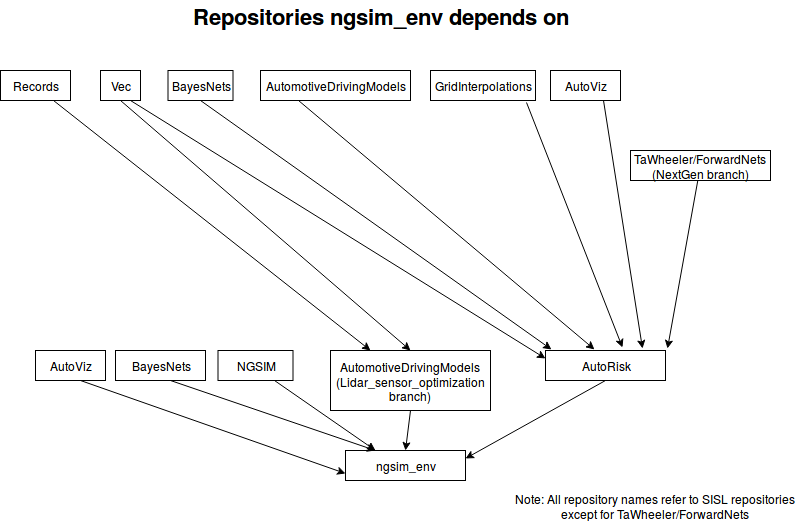

# NGSIM Env
- This is a rllab environment for learning human driver models with imitation learning

# Description
- This repository does not contain a [gail](https://arxiv.org/abs/1606.03476) / [infogail](https://arxiv.org/abs/1703.08840) / hgail implementation
  - The reason ngsim_env does not contain the GAIL algorithm implementation is to enable the codebase to be more modular. This design decision enables ngsim_env to be used as an environment in which any imitation learning algorithm can be tested. Similarly, this design decision enables the GAIL algorithm to be a separate module that can be tested in any environment be that ngsim_env or otherwise. The installation process below gets the GAIL implementation from [sisl/hgail](https://github.com/sisl/hgail)
- It also does not contain the human driver data you need for the environment to work. The installation process below gets the data from [sisl/NGSIM.jl](https://github.com/sisl/NGSIM.jl).
- Figure below shows a diagram of the repositories ngsim_env depends on:


# Installation Process
Step-by-step install instructions are at [`docs/install_env_gail_full.md`](docs/install_env_gail_full.md)

# Train and run a single agent GAIL policy: 
0. Navigate to ngsim_env/scripts/imitation
1. Train a policy, this involves running imitate.py 
```bash
python imitate.py --exp_name NGSIM-gail --n_itr 1000 --policy_recurrent True
```
2. Run the trained policy by using it to drive a car (this creates trajectories on all NGSIM sections using the trained policy). The training step was called imitate. This step is called validate.
```bash
python validate.py --n_proc 5 --exp_dir ../../data/experiments/NGSIM-gail/ --params_filename itr_1000.npz --random_seed 42
```
3. Visualize the results: Open up a jupyter notebook and use the visualize*.ipynb files.
  - the visualize family of ipynb's have headers at the top of each file describing what it does.
    - visualize.ipynb is for extracting the Root Mean Square Error
    - visualize_trajectories.ipynb creates videos such as the one shown below in the demo section
    - visualize_emergent.ipynb calculates the emergent metrics such as offroad duration and collision rate

## Training process: details
- see [`docs/training.md`](docs/training.md)

## How this works?
- See README files individual directories for details, but a high-level description is:
- The python code uses [pyjulia](https://github.com/JuliaPy/pyjulia) to instantiate a Julia interpreter, see the `python` directory for details
- The driving environment is then built in Julia, see the `julia` directory for details
- Each time the environment is stepped forward, execution passes from python to julia, updating the environment

## Demo
### To reproduce our experiments for the multiagent gail paper submitted to IROS, see 
[`scripts/imitation/README.md`](scripts/imitation/README.md)

### GAIL in a single-agent environment


### Single agent GAIL (top) and PS-GAIL (bottom) in a multi-agent environment


## References
---
If you found this library useful in your research, please consider citing our [paper](https://arxiv.org/abs/1803.01044) and/or 
[paper](https://arxiv.org/abs/1903.05766):
```
@inproceedings{bhattacharyya2018multi,
  title={Multi-agent imitation learning for driving simulation},
  author={Bhattacharyya, Raunak P and Phillips, Derek J and Wulfe, Blake and Morton, Jeremy and Kuefler, Alex and Kochenderfer, Mykel J},
  booktitle={2018 IEEE/RSJ International Conference on Intelligent Robots and Systems (IROS)},
  pages={1534--1539},
  year={2018},
  organization={IEEE}
}

@article{bhattacharyya2019simulating,
  title={Simulating Emergent Properties of Human Driving Behavior Using Multi-Agent Reward Augmented Imitation Learning},
  author={Bhattacharyya, Raunak P and Phillips, Derek J and Liu, Changliu and Gupta, Jayesh K and Driggs-Campbell, Katherine and Kochenderfer, Mykel J},
  journal={arXiv preprint arXiv:1903.05766},
  year={2019}
}
```
